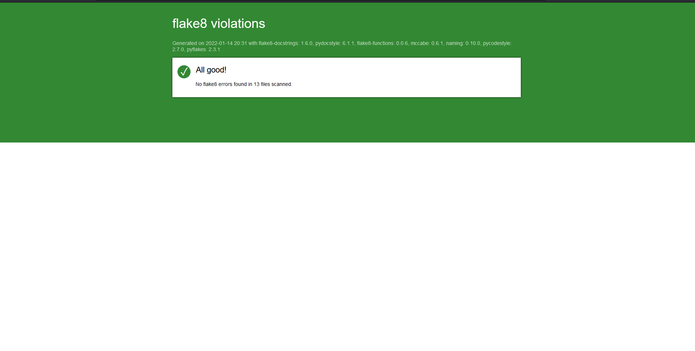

# ocr-p4 Développez un programme logiciel en Python
Disclaimer

---

This code is part of the openclassrooms learning adventure split in 13 business alike projects.  
  
  
This one is to code a chess management app following the rules of Swiss tournament.  
Some materials or links may have rights to be granted by https://openclassrooms.com. 
The additionnal code follows "CC BY-SA ".
  
** Not to be used for production **  


---
## Objet.  
  
Mettre à disposition d'un club d'échec une application permettant de gérer, hors ligne, des tournois d'échec selon les régles d'appairement des joueurs du tournoi suisse.   

Le caractère "hors-ligne" évite de dépendre d'une connexion Internet, les tournois pouvant être organisés dans des lieux plus ou moins équipés technologiquement.  
  
  
## Fonctionnement du logiciel:  

***************
 Menu Accueil
***************

10 Gérer les joueurs

20 Gérer les tournois

30 Gérer les rapports

90 Quitter l'application

***************
Votre choix:


### _A. Préparation._  
  
#### __A.1. Création d'une base de joueur.__   
  
Nous vous conseillons de constituer une base des joueurs de manière permanente et idéalement avant le jour de la compétition.  

Pour ce faire :   

> sur le menu Principal, choisir l'option "10 Gérer les joueurs"  
  
puis   
  
> choisir l'option "20 Ajouter un joueur en base"  
  
  
*************************
 Menu Gérer les joueurs
*************************

10 Afficher les joueurs en base

20 Ajouter un joueur en base

30 Mettre à jour ELO

80 Retour à l'accueil

90 Quitter l'application

*************************
Votre choix:

#### __A.2. Création d'un tournoi.__  
  
Dès que vous avez fixé les modalités d'un tournoi, vous pouvez créer un tournoi dans la base en précisant les détails pratiques dates, lieu, type de match. 

Pour ce faire :   

> sur le menu Principal, choisir l'option "20 Gérer les tournois"  
  
puis   
  
> choisir l'option "20 Créer un tournoi"  
  
  
**************************
 Menu Gérer les tournois
**************************

10 Afficher les tournois

20 Créer un tournoi

30 Inscrire des joueurs à un tournoi

...


80 Retour à l'accueil

90 Quitter l'application

**************************
Votre choix:
  
#### __A.3. Enregistrement des joueurs à un tournoi.__  
  
Au fur et à mesure de l'inscription des joueurs, vous pourrez les ajouter en tant que participants du tournoi.
Si un joueur n'est pas déja présent en base, il vous faut préalablement l'y ajouter en suivant les instructions du "A.1. Création d'une base de joueur."

Pour enregistrer un joueur inscrit à un tournoi :   

> sur le menu Principal, choisir l'option "20 Gérer les tournois"  
  
puis   
  
> choisir l'option "30 Inscrire des joueurs à un tournoi"  
  

### _B. Déroulement d'une compétition_

Dans l'application, l'essentiel des options est accessible dans le menu "20 Gérer les tournois".

Pour y aller :   

> sur le menu Principal, choisir l'option "20 Gérer les tournois" 


#### __B.1. Ouvrir un tournoi.__  

Le jour du tournoi lorsque les joueurs sont tous présents, vous ouvrez le tournoi sur l'application qui constituera la première ronde selon l'appariement du tournoi suisse, càd selon leur rang ELO. Une fois triée, la liste des joueurs est divisée en 2 parties égales, le 1er joueur de la sous-liste 1 (haut classé ELO) affrontera le 1er joueur de la sous-liste 2  (moins bien classé ELO), le 2nd joueur de la sous-liste 1 affronte le 2nd joueur de la sous-liste 2 et ainsi de suite jusqu'au dernier.  
En cas de nombre impair d'inscrit, le dernier joueur gagne d'office.

Une ronde est soit :
* "encours"  càd ouverte,  
* "finie" lorsque le chronomètre a été arrétée  
* "close" lorsque les résultats ont été saisis.
 
> choisir l'option "40 Ouvrir un tournoi"  
  

#### __B.2. Fermer une ronde.__  
Selon le nombre de ronde définie à la création du tournoi, le cycle suivant va se répéter : 
"fermer une ronde", "mettre à jour les résultats" et "ouvrir la ronde suivante".

Lorsque le temps imparti à l'épreuve sera écoulé, vous fermerez la ronde, ce qui arrêtera le chronomètre de l'application.

> choisir l'option "50 Fermer une ronde"  

#### __B.3. Mettre à jour les résultat.__  

Vous aurez alors à saisir les résultats de cette première ronde.

> choisir l'option "60 Mettre à jour les résultats"  

#### __B.4. Ouvrir ronde suivante.__  

Sur la base des résultats des rondes précédantes de ce tournoi, l'application calculera un appairement des joueurs pour la ronde suivante et proposera la répartition des joueurs en tables de jeu correspondantes.
La liste des joueurs est cette fois triée selon le score du tournoi actuel et en cas d'égalité sur ce tournoi selon le second critère du classement ELO. Le premier joueur de la liste affrontera le second joueur de cette liste. Si les 2 joueurs se sont déja rencontrés au cours du tournoi alors le 3ème joueur sera considéré et ainsi de suite.
Notez qu'il est possible que deux joueurs s'affrontent plus d'une fois si le nombre de ronde prévue est égale ou supérieure au nombre de paire de joueur.


> choisir l'option "70 Ouvrir ronde suivante"  

et ce cycle se répétera jusqu'à ce que toutes les rondes prévues aient été jouées.


#### __B.5. Clore un tournoi.__  

Une fois l'ensemble des rondes jouées, la cloture du tournoi va vous permettre de basculer les résultats obtenus sur la fiche individuelle des joueurs. Le rang ELO n'est pas modifié pour autant car c'est du ressort de la fédération mais vous disposerez à coté du rang ELO du joueur de son classement aux tournois que vous aurez organisé.


**************************
 Menu Gérer les tournois
**************************

10 Afficher les tournois

20 Créer un tournoi

30 Inscrire des joueurs à un tournoi

40 Ouvrir un tournoi

50 Fermer une ronde

60 Mettre à jour les résultats

70 Ouvrir ronde suivante

75 Clore un tournoi

80 Retour à l'accueil

90 Quitter l'application

**************************
Votre choix:

  
   


### C. Aspect technique

L'application mémorise les données à chaque changement d'option de menu. Vous n'aurez donc pas à lancer manuellement une opération de copie de la base vers un fichier d'ordinateur.

Cependant le matériel étant faillible, nous vous conseillons de faire régulièrement une copie sur un support externe à votre convenance (disque dur, clé USB, téléphone etc.) du répertoire data et de son fichier db.json (alt. dbtest.json).  
  
Par ailleurs, nous vous recommandons de mettre à jour l'application périodiquement pour soit bénéficier d'amélioration, soit limiter les failles potentielles de sécurité.


## Installation.

Pour utiliser l'application,   
il est conseillé sous le prompt bash python (ici cmd Anaconda3 sous Windows 11):  

1. de cloner l'ensemble du répertoire github dans un répertoire local dédié.  
        ``` git clone https://github.com/dev-KC20/ocr-p4v2.git  

2. se déplacer dans le sous répertoire de travail ocr-p4v2  
        ``` cd ocr-p4v2  

3. de créer un environnement virtuel python, env  
        ``` python -m venv env  

4. d'activer un environnement virtuel python, env  
        ``` env\scripts\activate.bat  

5. d'installer les paquets requis pour mémoire,   
        ``` pip install -r requirements.txt  

6. d'executer le script  
        ``` python main.py  

  
Le logiciel stocke les données dans un fichier texte au format json sous un répertoire "data". Assurez-vous que le logiciel ait les droits de créer le répertoire "data" et le fichier "db.json" (alternativement "dbtest.json").  


## Développement

Nous avons tenté de suivre les principes de la programmation orientée objet (classs, encapsulation, héritage) et de respecter le cadriciel MVC en séparant le code en 3 ensembles :   
* Models pour les données,  
* Views pour l'interaction avec l'utilisateur et  
* Controllers pour la logique "Métier".  
  
L'application est développée avec le language Python, en version 3.9.7.   

La persistence des données est réalisée par TinyDB en version 4.5.2.  

Sa conformité aux recommendations de style de la PEP8 a été validée par le paquet flake8 en version 4.0.1.  

L'IDE est Visual Studio Code v1.63.  


  

Pour produire votre propre rapport flake8, procédez ainsi :
dans votre environnement virtuel sous le prompt bash python :  

1. d'installer les paquets requis pour mémoire,   
        ``` pip install flake8  
2. d'executer le script  
        ``` flake8 --format=html --htmldir=flake8_report  
  
Pour respecter certaines demandes du cahier des charges, le fichier de configuration ".flake8" a été adapté :  

```
[flake8]
max-line-length = 119
max-function-length=50
doctests = True
# no time yet to divide __init__ or create a factory fonction
extend-ignore = CFQ002 
```  
  
Par ailleurs "max-function-length=50" a demandé l'installation du plugin flake8 :  
1.5. d'installer les paquets requis pour mémoire,   
        ``` pip install flake8-functions  

Le fichier nous a permis d'exclure certains messages, ici une incompatibilité entre 2 alertes `W504` et `W503` (cf. plus bas la ref.) 
et pour notre cas `CFQ002` car nous n'avions pas le temps de développer une fonction de factory et réduire à 6 les arguments de l'instanciation via __init__().


ref:  

[python - W504 line break after binary operator - Stack Overflow](https://stackoverflow.com/questions/67942075/w504-line-break-after-binary-operator)

`W504` and `W503` conflict with each other (and are both disabled by default) -- by setting `ignore` you've re-enabled them. `extend-ignore` does not have this problem as it augments the default set of ignored codes
